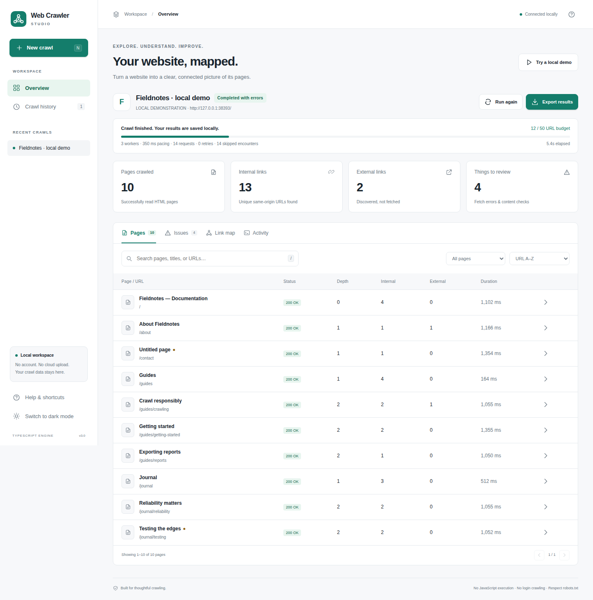

<div align="center">

# Web Crawler Studio
### A TypeScript crawler with a human-friendly workspace.

**Start with a URL. Explore its pages. Understand the connections.**

[Download a portable release](https://github.com/Alex-Unnippillil/web-crawler/releases/latest) · [Getting started](#getting-started) · [Using the app](#using-the-app) · [Troubleshooting](#troubleshooting) · [For developers](#for-developers)

</div>



A local-first browser application built around a bounded TypeScript web crawler. No account, API key, database service, or subscription. The original command-line interface and Boot.dev page fields are preserved.

## What you can do

- **Start a crawl without a command line.** Enter a URL, choose Quick look / Site review / Deeper dive, and adjust the limits only when needed.
- **See what is happening.** Live counts, URL-budget progress, current requests, activity logs, pause/resume, and stop with partial results.
- **Inspect real results.** Search, filter, sort, and paginate pages. Open a page inspector for headings, descriptions, canonical URLs, inbound links, outgoing links, and image URLs.
- **Review problems.** Fetch errors, missing titles/headings/descriptions, and repeated titles are reported separately. These are basic checks, not an SEO score or a comprehensive audit.
- **Explore connections.** Selectable link-map nodes, keyboard selection, pan/zoom, and an SVG export.
- **Keep and share the work.** Persistent local history and JSON, complete-crawl JSON, CSV, standalone HTML, and SVG downloads. Dark/light themes, responsive layouts, keyboard shortcuts, and accessible native dialogs.

## Getting started

### Easiest: portable download — no Node.js installation

Open **[GitHub Releases](https://github.com/Alex-Unnippillil/web-crawler/releases/latest)** and download the ZIP for your computer from **Assets**. Do not choose GitHub's automatically generated *Source code* ZIP when you want the bundled runtime.

| Computer | Download suffix | After extracting the entire ZIP |
|---|---|---|
| Windows 10/11, Intel/AMD 64-bit | `win-x64.zip` | Double-click **Start Web Crawler.cmd** |
| Ubuntu/Linux, Intel/AMD 64-bit | `linux-x64.zip` | Open a terminal in the folder and run `bash start.sh` |
| Mac with Apple Silicon | `darwin-arm64.zip` | Run `bash "Start Web Crawler.command"` in that folder, or double-click after making it executable |
| Mac with an Intel processor | `darwin-x64.zip` | Same macOS launcher |

The launcher starts the local server and opens **http://localhost:4310** in your usual browser. Keep the terminal window open while using it. Press **Ctrl+C** in that window to close the server and save partial results.

The portable ZIP includes an official Node.js 24 runtime and production dependencies. It does not install a system service or require administrator access. Builds are **unsigned and not notarized**. Verify the release SHA-256, review the source, and follow your organization's security policy; do not blindly dismiss OS warnings. An included Node license and runtime-source checksum document the bundled runtime.

If portable assets are not yet available for a release, the source setup below is the fallback. Release builds run only after automated tests pass.

### Source download — Windows, without Git

1. Install **[Node.js 24 LTS](https://nodejs.org/en/download)**. Reopen your terminal after installation.
2. On this repository, click **Code → Download ZIP**.
3. Extract the **entire** ZIP to a normal folder, such as `Documents\Web Crawler`.
4. Double-click **Start Web Crawler.cmd**.
5. First launch installs locked dependencies and builds the app. It requires internet access. Later launches reuse the installed dependencies unless the lockfile changes.

Do not run the launcher from inside the compressed ZIP. The source ZIP needs Node.js; the portable release ZIP includes it.

### Ubuntu / WSL / macOS / Linux — from Git

Install Node.js 24 LTS and Git, then run:

```bash
git clone https://github.com/Alex-Unnippillil/web-crawler.git
cd web-crawler
npm ci
npm run gui
```

Open **http://localhost:4310** in your browser if it does not open automatically. On WSL, use your **Windows** Edge/Chrome browser; no Linux desktop or `xdg-open` package is required. Windows normally forwards localhost connections to services running in WSL; see [Microsoft's WSL networking documentation](https://learn.microsoft.com/en-us/windows/wsl/networking).

Alternatively, after cloning or extracting the source, run:

```bash
bash start.sh
```

The launcher installs dependencies if needed, builds the application, and starts it. With `nvm`, `nvm install 24 && nvm use 24` selects the recommended runtime.

### Updating an existing clone

```bash
cd ~/web-crawler
git status --short
git pull --ff-only
npm ci
npm run gui
```

Commit or back up your own edits before updating. If Git says your history diverged—for example, you made a local upgrade commit that was never pushed—**do not reset or force-pull over your work**. Make a fresh sibling clone instead:

```bash
git clone https://github.com/Alex-Unnippillil/web-crawler.git ~/web-crawler-studio
cd ~/web-crawler-studio
npm ci
npm run gui
```

History is stored outside the repository, so another clone under the same OS user uses the same local history directory. A Windows process and a WSL process have different home directories and therefore separate histories.

## Using the app

### 1. Try it without crawling anyone else's site

Click **Try a local demo**. This starts a small, real HTTP website on your computer and crawls it. It intentionally includes a broken link, missing metadata, a redirect, and a robots-disallowed path. No external site is fetched. This is not fabricated crawl output.

### 2. Start a real crawl

Click **New crawl**, enter a public website you own or have permission to crawl, optionally name the run, and choose a preset:

| Preset | Candidate URL budget | Best first use |
|---|---:|---|
| Quick look | 50 | Check configuration and explore a small site |
| Site review | 200 | A documentation section or small website |
| Deeper dive | 500 | A larger bounded inventory |

A missing scheme is prefixed with `https://`. Advanced settings expose the URL limit, discovery depth, concurrency, request spacing, timeout, run deadline, path boundary, and tracking-parameter removal. A path boundary such as `/docs` requires the starting URL to be inside that path.

The GUI always respects `robots.txt`, limits requests to the same origin, and does not follow external links. It allows up to 8 workers, at least 100 ms between request starts, and up to 60 minutes per run. The page-record budget is 32 MiB, after which it stops and retains partial results. Large or noisy sites should be crawled in smaller path-scoped runs.

### 3. Understand the progress

**The progress bar measures the candidate URL budget used, not a percentage of the entire website.** The crawler cannot know the total site size in advance. Failed and non-HTML candidates consume the budget. Reaching the budget produces a partial inventory.

**Pause** prevents new HTTP requests from starting. In-flight requests may finish; the overall run deadline continues. **Resume** continues the same run. **Stop** cancels remaining work and saves completed pages. **Run again** starts a new run; it is not an incremental/resumed crawl.

### 4. Inspect the results

**Pages:** search URL/title/heading, filter pages needing review or having external links, sort, and paginate. Click a page to open its inspector. On narrow screens the table prioritizes page and HTTP status; the inspector provides the remaining details.

**Issues:** review HTTP/network failures and basic content checks. A missing description may be intentional; findings are not ranked SEO judgments. A failed URL's inspector lists crawled pages linking to it. External URLs have not been availability-checked.

**Link map:** successful pages only, capped at 80 interactive nodes and 1,200 connections for responsiveness. Drag the background to pan, scroll to zoom, or select a node. The separately exported SVG uses the report renderer's 120-node / 2,000-connection cap.

**Activity:** the latest 250 diagnostic entries, with timestamps. TLS verification is never disabled to make a crawl succeed.

### 5. Export and return later

Use **Export results**. Downloads go to your browser's normal Downloads location, not automatically to the repository's `reports/` folder.

| Format | Contents |
|---|---|
| HTML | Standalone searchable report; open or share without running the app |
| CSV | Flat page inventory for spreadsheets; formula-like fields are escaped |
| JSON pages | Array of page records, including the original Boot.dev fields |
| Complete crawl JSON | Pages, failures, options, warnings, and summary |
| SVG | Static link-map image |

Exports include current/partial results. Review URLs and extracted content before publishing or sharing; query strings can contain private information.

**History** reopens saved crawls and offers a confirmed delete action. Up to 30 runs can be kept; export and delete old ones to free room. Checkpoints are saved during a crawl. An interrupted run can be inspected after restarting, but it is not automatically resumed.

### Keyboard shortcuts

`N` opens a new crawl. `/` focuses page search. `Esc` closes a dialog. Arrow keys navigate result tabs. Tab/Enter navigate and activate controls; Enter/Space open a focused graph node. Shortcuts do not steal typing inside inputs.

## Where data is stored

Default directory: `~/.web-crawler-studio` (Linux, WSL, and macOS), or `%USERPROFILE%\.web-crawler-studio` (native Windows). The Help dialog displays the exact directory. Override it with `CRAWLER_DATA_DIR` before starting the app.

No account, telemetry, cloud storage, remote fonts, CDN scripts, or third-party images are used by the GUI. Websites you crawl still receive network requests and your public IP address. Browser exports and CLI report files are separate from the GUI history.

## Original TypeScript CLI

The original command is preserved:

```bash
npm run start "https://learnwebscraping.dev/practice/ecommerce/" 2 20
```

Or use named options:

```bash
npm start -- "https://example.com" \
  --concurrency 3 \
  --max-pages 50 \
  --max-depth 5 \
  --timeout-ms 15000 \
  --delay-ms 300 \
  --out reports/example.json
```

```bash
npm start -- --help
npm run demo
```

The CLI writes JSON, CSV, HTML, SVG and summary JSON files to the requested prefix. `npm run demo` remains a separate nine-page command-line fixture; the GUI demo has ten pages and intentional defects.

The original JSON fields remain: `url`, `heading`, `first_paragraph`, `outgoing_links`, `image_urls`. Crawl-map keys now use full URLs; failed fetches are diagnostics rather than fake empty pages. Do not depend on the original lossy internal key format.

## Troubleshooting

| Symptom | What to do |
|---|---|
| `npm error Missing script: gui` | You are in the old project copy. Use `pwd`, `npm run`, and the update/fresh-clone instructions above. |
| Browser did not open | Copy the printed `http://localhost:4310` URL into your normal browser. Leave the terminal running. |
| Port already in use | Open the existing instance, or use `npm run gui -- --port=4311`. Portable launch: `node scripts/launch.mjs --port=4311` with the bundled runtime path. |
| `node` / `npm` not found | Use a portable release, or install Node.js 24 LTS and reopen the shell. In WSL install Linux Node, not just Windows Node. |
| WSL cannot reach the app | Try `http://127.0.0.1:4310`, verify the server is running, and check Microsoft's localhost-forwarding documentation. Do not expose the server on `0.0.0.0`. |
| Connection lost / session expired | Restart the launcher if it stopped. Refresh the browser after a server restart to obtain the new session token. |
| Zero pages | Inspect Issues and Activity. The target may be offline, non-HTML, robots-disallowed, redirecting to another origin, or requiring login/JavaScript. |
| Redirect blocked | Start with the site's final canonical origin, e.g. the `www` or HTTPS URL it redirects to. Origins are deliberately not expanded automatically. |
| Private target blocked | The GUI rejects private/reserved/loopback targets, including cloud metadata addresses. Use the built-in demo; use the CLI deliberately for authorized local development sites. |
| macOS launcher is not executable | From its folder run `bash "Start Web Crawler.command"`, or `chmod u+x "Start Web Crawler.command"` and open it. Observe OS security policy for unsigned code. |
| Dependency install fails | Check internet/DNS access and Node version. Run `npm ci` to see the actual error. Do not disable TLS or substitute an untrusted registry. |
| Saved data cannot be written | Check the history directory's permissions/free space. Export the current results before closing. |

## Boundaries and security

This is an **HTML crawler**, not a browser automation engine. It does not execute website JavaScript, sign in, carry session cookies, submit forms, solve challenges, bypass anti-bot controls, or fetch external links/images. Discovery depth is not a guaranteed shortest-path metric. Inventory completeness is limited by budgets, scope, available links, and robots rules.

The GUI binds to loopback only. API calls require a random per-process session token; Host and Origin checks prevent cross-site use and DNS-rebinding access to the local server. Outbound GUI requests resolve and pin a checked public IP for each request, including redirects; private/reserved targets are blocked. Remote HTML is treated as untrusted text, not inserted as executable markup. Do not deploy the GUI as a public or multi-user service. See [SECURITY.md](SECURITY.md).

CLI defaults are preserved and intentionally do **not** share the GUI's private-address restriction. Do not expose the CLI behind an unauthenticated service. Scheduling/email monitoring remains an optional, separate workflow documented in [docs/MONITORING.md](docs/MONITORING.md); no timers or email services are installed by the GUI.

## For developers

The frontend is **TypeScript using browser-native DOM APIs**; it does not add a frontend framework or runtime CDN dependency. The backend is TypeScript using Node's HTTP server. The GUI reuses the crawl engine rather than maintaining a second crawler.

```text
src/engine.ts             Queue, transport budgets, retries, robots and crawl hooks
src/extract.ts            Single-pass jsdom extraction; no script execution
src/report.ts             JSON, CSV, HTML and SVG reports
src/studio/server.ts      Loopback HTTP API, session protection and static assets
src/studio/jobs.ts        Job lifecycle, pause/stop, checkpoints and local history
src/studio/network.ts     Public-address validation and DNS-pinned requests
src/studio/demo.ts        Owned local demonstration website
ui/app.ts                 Typed browser UI and interactions
ui/index.html             Semantic shell and accessible dialogs
ui/styles.css            Responsive light/dark design system
scripts/launch.mjs        Source/portable launcher
scripts/package-portable.mjs  Verified-runtime release packaging
```

```bash
npm ci
npm run check             # Type checks, Vitest, build, core + GUI API tests
npm run gui               # Builds and opens the browser application
npm run demo              # Full-parser CLI integration demo
python3 -m unittest discover -s tests -p 'test_*.py'
```

For browser integration tests, install Python Playwright and its Chromium browser, then run `python3 tests/e2e.py`. CI performs this against the actual application and jsdom parser, not a screenshot mock. The local fixture-based API tests explicitly isolate parsing; the Vitest suite and demos cover real extraction. See [docs/VALIDATION.md](docs/VALIDATION.md).

Portable packages are built after validation with Node 24:

```bash
npm run package:portable -- win-x64
npm run package:portable -- linux-x64
npm run package:portable -- darwin-arm64
npm run package:portable -- darwin-x64
```

Packaging requires Linux, Python 3, `tar`, npm, and internet access to the official Node distribution server. Runtime checksums are verified against its HTTPS manifest. The release workflow creates versioned ZIPs and SHA-256 sidecars; runtime OS smoke tests are distinct from full GUI tests and are documented in CI.

## License & attribution

ISC. Built from the Boot.dev TypeScript crawler project and extended into a local desktop-style workspace. Node.js and dependencies retain their own licenses. Only crawl websites with appropriate authorization and respect their terms and technical limits.
