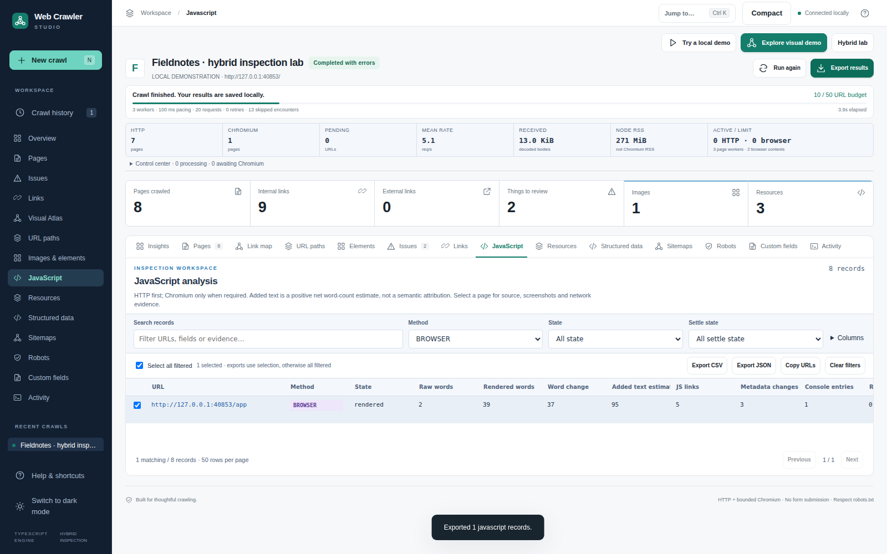
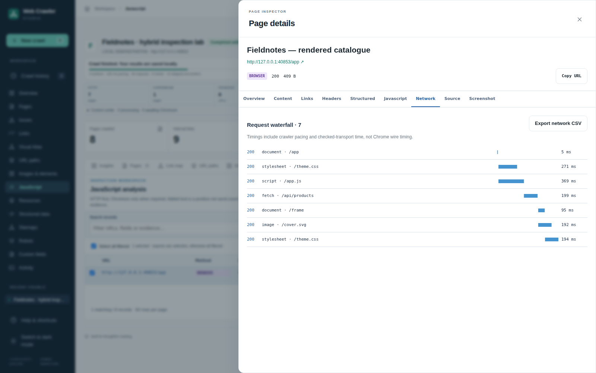

<!-- Repository note: Setup, daily operation, downloads, and limits for Web Crawler Studio. -->
# Web Crawler Studio

**A local-first TypeScript crawler for HTML and JavaScript websites.**

[Download](https://github.com/Alex-Unnippillil/web-crawler/releases/latest) · [Getting started](#getting-started) · [Using the app](#using-the-app) · [Hybrid architecture](docs/HYBRID.md) · [Security](SECURITY.md)



Enter a URL, choose a crawl mode, and explore pages, links, images, resources, structured data, and site architecture. Smart mode uses lightweight HTTP first and escalates sparse application shells to a reusable Chromium browser only when needed. No cloud account, API key, hosted database, or subscription is required.

## What is new

- **Three crawl modes:** Fast HTTP, Smart Hybrid, and Full Browser, with a processing-method label and escalation reason for every page.
- **Rendering evidence:** raw HTML versus rendered DOM, title/heading/canonical/robots changes, added and removed links/images, text estimates, screenshots, console diagnostics, and a request waterfall.
- **Analysis workspaces:** JavaScript, Links, Resources, Structured Data, Sitemaps, Robots, and Custom fields. Filter, sort, choose columns, select rows, copy URLs, and export only matching or selected records.
- **Safer discovery:** bounded nested/compressed sitemaps, URL provenance, same-origin frames and open shadow roots, responsive/lazy image variants, and non-submitting form inspection.
- **Reusable configuration:** local profiles with rename, duplicate, import/export, and confirmed deletion; bounded CSS-selector extraction without editing source code.
- **Denser operation:** live HTTP/browser/queue/memory metrics, grouped issues with filtered CSV, searchable command palette, and richer page inspectors. The Visual Atlas, URL Paths, image gallery, themes, and original TypeScript CLI remain available.

## Getting started

### Windows: download, extract, launch

1. Open [Releases](https://github.com/Alex-Unnippillil/web-crawler/releases/latest) and download the application asset ending in **`win-x64.zip`** for an Intel/AMD 64-bit computer. GitHub's *Source code* ZIP is not the portable application.
2. Right-click the ZIP, choose **Extract All**, and keep the entire extracted folder together.
3. Double-click **`Start Web Crawler.cmd`**. Keep its terminal window open while using Studio.
4. Open **http://localhost:4310** in Edge/Chrome if it does not open automatically.
5. For JavaScript rendering, double-click **`Install Browser.cmd`** once. This explicitly downloads the matching Chromium build. Then use **Recheck installation** in Studio or restart it.

The portable package includes Node.js and dependencies. Chromium is an **optional separate download**, not hidden in first launch. Fast HTTP needs no browser installation. Without Chromium, Smart mode still crawls HTTP content and visibly reports unsuccessful escalation; Full Browser refuses to start with an installation message.

Builds are unsigned and not notarized. Verify the release's `.sha256` sidecar, use the matching platform, and follow your organization's security policy. Do not disable operating-system security protections to run the application.

### Ubuntu / WSL / Linux / macOS: source installation

Install Git and **Node.js 24**, then:

```bash
git clone https://github.com/Alex-Unnippillil/web-crawler.git
cd web-crawler
npm ci
npm run browser:install   # optional Chromium download for Smart / Full Browser
npm run gui
```

On WSL, open **http://localhost:4310** in your Windows browser. No Linux desktop is necessary. An existing `nvm` installation can select the runtime with `nvm install 24 && nvm use 24`.

On Linux, missing Chromium system libraries can be installed separately with `npx playwright install-deps chromium` using administrator approval. **Run Studio as your normal user, never as root or with `sudo`.** Browser sandbox restrictions should be resolved through an approved OS configuration; Studio does not expose a `--no-sandbox` escape hatch. See [browser troubleshooting](docs/HYBRID.md#browser-installation-and-sandbox).

Subsequent launches:

```bash
cd ~/web-crawler
bash start.sh
```

### Other portable platforms

| Platform | Asset suffix | Launch | Optional Chromium install |
|---|---|---|---|
| Linux x64 | `linux-x64.zip` | `bash start.sh` | `bash install-browser.sh` |
| Apple Silicon | `darwin-arm64.zip` | `bash "Start Web Crawler.command"` | `bash install-browser.sh` |
| Intel Mac | `darwin-x64.zip` | Same macOS launcher | Same installer |

Extract first; do not launch from inside a ZIP. macOS archives are unsigned/not notarized. OS-specific dependencies and sandbox support still apply even when Node is bundled.

### Updating your existing WSL clone

Back up or commit local edits first. From a clean `main` checkout:

```bash
cd ~/web-crawler
git status --short
git pull --ff-only origin main
npm ci
npm run browser:install
npm run gui
```

A diverged history is **not** a reason to reset or force-pull. Preserve your work and use a sibling clone instead:

```bash
git clone https://github.com/Alex-Unnippillil/web-crawler.git ~/web-crawler-studio
cd ~/web-crawler-studio
npm ci
npm run browser:install
npm run gui
```

## Using the app

### 1. Try the local demonstrations

**Try a local demo** exercises a small static website. **Explore visual demo** produces a richer graph and gallery. **Try hybrid lab** exercises generated navigation, structured data, a lazy-loaded image, an open shadow root, a same-origin iframe, and a read-only endpoint. These are real loopback HTTP fixtures, not fabricated crawl records. The hybrid demonstration needs Chromium for its rendered results.

### 2. Configure a crawl

Choose **New crawl**, enter a public website you own or have permission to crawl, choose a mode and preset, and start. Advanced options are optional.

| Mode | What happens | Use it for |
|---|---|---|
| **Smart Hybrid** | HTTP first; selectively render sparse/script-dependent pages | Recommended first investigation |
| **Fast HTTP** | Parse source HTML only; never launch Chromium | Traditional/server-rendered sites and lower resource use |
| **Full Browser** | Fetch raw HTML and render each successful HTML candidate | Client-rendered applications and raw/rendered comparison |

Smart detection is heuristic. Framework presence alone does **not** trigger rendering. A server-rendered React/Next page can correctly remain HTTP. Use Full Browser when important content is generated despite meaningful initial HTML. A browser failure is evidence, not a successful render: Smart retains the raw result with the failure reason.

Advanced settings include scope/depth, HTTP concurrency and pacing, browser workers, rendering deadline, bounded scroll iterations, screenshots, sitemap discovery/explicit sitemap URLs, and custom CSS rules. No automatic form submissions or arbitrary button clicking occur.

**Profiles** save settings, not results. They are stored in this browser's local storage; export them before clearing browser data or changing browsers. Import is confirmed because it replaces the current profile collection.

### 3. Observe the crawl

Live telemetry distinguishes HTTP pages, rendered pages, queued URLs, active HTTP/browser work, measured request count, elapsed time, mean rate, and Node memory. Activity records retries, exclusions, rendering decisions, and errors. Memory-aware mode reduces page-worker concurrency when Node RSS exceeds its soft threshold; this is not a hard process-memory ceiling.

**Pause** prevents new work from starting, but in-flight requests can finish. The overall deadline continues. **Stop** cancels remaining work and preserves completed pages. **Run again** creates a new run; persisted queue state is diagnostic information, not cross-restart resumability.

**URL-budget progress is not percentage of the whole website.** The site size is unknown; failures, non-HTML responses, redirects, and exclusions can consume candidate budget. A capped run is a partial inventory.

### 4. Explore the analysis workspaces

| Workspace | Questions it helps answer |
|---|---|
| Pages / Issues | Which URLs succeeded, failed, redirected, or need content/indexability review? Which used Chromium? |
| Links | Where does a link come from? What is its anchor/rel? Which captured pages link to a failed URL? |
| Visual Atlas | How are observed hyperlinks connected? Which nodes rendered in Chromium or occur in a sitemap? |
| URL Paths | How are captured URLs distributed across host, directory, and page paths? |
| Elements | Which images, headings, links, declared resources, and form structures were found? |
| JavaScript | What did rendering change? Why did Smart escalate? Which links exist only after rendering? |
| Resources | Which assets or GET endpoints were referenced/observed? Which failed or took longer? |
| Structured Data | Which JSON-LD types were parsed? Which blocks were malformed? What microdata/RDFa was observed? |
| Sitemaps / Robots | What discovery files were retrieved, what do they contain, and how do they compare with this bounded crawl? |
| Custom fields | What did your named CSS selectors extract, and where did a selector fail? |
| Insights / Activity / History | What patterns, diagnostics, and previous runs are available? |

Analysis grids use sticky headers and bounded pages of rows. Combine text/category filters, sort columns, choose visible columns, select rows, and export CSV/JSON. **Selected rows take precedence over filtered rows for export**; clear selection to export the matching view. Page and issue CSV actions follow their current filters. Unknown status, bytes, or duration are not presented as successful/zero observations.

### 5. Inspect an individual page

Select a page or graph node to open the contextual inspector. Tabs include content, links, headers, structured data, JavaScript, network, source, and screenshot. Browser evidence is loaded on demand rather than included in every poll.

The Source tab shows escaped source and a bounded line-oriented comparison. Download the stored evidence JSON for complete retained source. Remote HTML is **never mounted as trusted application markup**. The screenshot is what Chromium captured in its viewport; it is not a live embedded page. Network timings describe the guarded transport, including pacing/queue delay, not an exact Chrome DevTools wire-timing trace.

JS content percentage is a **net word-count estimate**, not proof of which script authored every word. A sitemap URL with no captured inlink is not proven orphaned: the crawl may be bounded or incomplete. Schema parsing is not a structured-data eligibility certification. Technology labels are heuristics with evidence/confidence, not guaranteed detection.

### 6. Use Visual Atlas and images

The Atlas preserves the spiderweb, depth-ring and discovery-tree layouts, focus neighborhood, route tracing, status filters, stable selection, search, legend, zoom/pan, and SVG/PNG export. New controls filter rendering method and sitemap membership and color by directory, status, or method. Sitemap membership/no-captured-inlink markers do not invent hyperlinks. The edge list describes observed anchors; the discovery tree describes crawl provenance.

The interactive view is bounded to **500 nodes / 8,000 edges**. The label shows displayed versus available nodes. Larger inventories remain searchable in tables and downloadable as complete graph JSON. The classic static report graph has a separate smaller cap.

In Elements → Images, search URLs/alt/source, filter alt states, switch grid/list, and inspect variants and source pages. Thumbnails remain opt-in. Raster previews are served through the guarded local endpoint; remote SVG is never embedded. Browser-rendered pages can also expose measured image dimensions and observed response information. Merely declaring an image URL does not mean the file was fetched or verified.

### 7. Define custom extraction

Under advanced extraction, add a name, CSS selector, output mode, and optional attribute. Examples:

| Name | Selector | Mode | Attribute |
|---|---|---|---|
| Price | `.product-price` | text | — |
| Product ID | `[data-product-id]` | attribute | `data-product-id` |
| Description block | `main .description` | HTML | — |

Rules run on the selected final document (rendered when rendering succeeds). Invalid selectors are reported. HTML output is inert text. Rules cannot execute scripts, submit forms, or read arbitrary local files. Limits: 12 rules, 30 values per rule, 2,000 characters per value. XPath and unrestricted scripting are not supported.

### 8. Export and save

Existing complete-crawl JSON, page JSON, CSV, standalone HTML, and SVG exports remain. Targeted analysis CSV/JSON exports cover links, resources, schema, JavaScript findings, sitemap comparisons, and custom fields. Atlas exports SVG/PNG/JSON; images export CSV/JSON.

GUI downloads use your browser's Downloads location. CLI reports use the requested output path. Captured source/screenshots/network evidence remain local, separate from the compact crawl record; export them explicitly from the inspector. Review extracted data before sharing: URLs, source, console messages, and visible screenshots may contain sensitive website data.

History lives under `~/.web-crawler-studio`, not in the repository, unless `CRAWLER_DATA_DIR` overrides it. Up to 30 runs are retained. Deleting a run also deletes its owned browser evidence. Windows and WSL have different home directories and therefore different histories. Clearing the browser's local storage removes profiles/views, not the server's saved crawl history.

### Keyboard and display

`Ctrl/Cmd+K` opens search/commands; try **show 404s**, **javascript pages**, **images missing alt**, **external links**, or a URL/path/title. `N` opens a new crawl; `/` focuses search; `Esc` closes dialogs. Tabs and arrow keys operate section/inspector controls. Atlas nodes have keyboard alternatives, fit/reset controls, and explicit zoom buttons. Light/dark themes, compact density, reduced-motion handling, and responsive layouts remain available. Wide analysis tables scroll horizontally rather than discarding columns.



## Boundaries and troubleshooting

- **Browser unavailable:** install Chromium explicitly and recheck. Smart degrades visibly to HTTP; Full Browser requires installation. Linux may also need system libraries and administrator-approved sandbox configuration.
- **JavaScript works differently from your browser:** the crawler blocks non-GET traffic, forms, WebSockets, service workers, downloads, permissions, and unsafe network destinations. Apps dependent on those features may be incomplete. There is no CAPTCHA/challenge bypass, login automation, proxy evasion, TLS disabling, or fingerprint spoofing.
- **Redirect outside scope:** start at the final public origin. Every document/frame destination remains same-origin and path/robots checked.
- **Robots restriction / 429:** use Robots and Activity to inspect the reason; respect the target's policy and reduce crawl speed. More workers do not make a blocked website available.
- **Browser deadlines/resource limits:** reduce concurrency, scope a smaller section, or adjust bounded render settings. Partial evidence and explicit diagnostics are preferable to an unbounded run.
- **Port busy:** close the existing Studio instance or run `npm run gui -- --port 4311`; use the address printed in the terminal.
- **WSL page will not open:** keep the process running and use Windows Edge/Chrome on the printed localhost address. Do not expose the application on `0.0.0.0` as a workaround.

The GUI allows at most 2,000 candidates/run, 8 page workers, 1–4 browser contexts, a 60-minute run deadline, and a 32 MiB compact-record budget. Browser pages additionally enforce request, response-byte, source, screenshot, scroll, context, and duration limits. Chromium process RSS is **not** hard-limited by these budgets. See [the detailed security and resource model](SECURITY.md).

## Command-line interface

The original invocation still works and remains Fast HTTP:

```bash
npm run start "https://example.com" 2 20
```

Named options expose rendering and discovery without changing the five original page fields (`url`, `heading`, `first_paragraph`, `outgoing_links`, `image_urls`):

```bash
npm start -- "https://example.com" --mode smart --concurrency 3 --max-pages 100 --out reports/site.json
npm start -- --help
```

Consult `--help` for current rendering, sitemap and output switches. The CLI writes normal reports plus richer complete JSON/evidence when available. GUI network restrictions are stronger than the developer-oriented CLI's direct fetch path; do not expose the CLI as a remote service. Optional POSIX scheduling/email remains documented in [MONITORING.md](docs/MONITORING.md).

## For developers

```bash
npm ci
npm run browser:install
npm run check
npm run demo
python3 -m unittest discover -s tests -p 'test_*.py'
python3 -m pip install playwright==1.63.0
python3 tests/e2e.py
python3 tests/hybrid_e2e.py
node tests/scale.mjs
```

Linux CI installs Chromium system dependencies before browser tests and sets `REQUIRE_BROWSER=1`; a missing browser cannot silently skip that acceptance gate. Python monitoring uses POSIX locks and runs on Linux/WSL/macOS, not native Windows. The TypeScript GUI/CLI support Windows separately.

The engine, renderer, extraction, analysis, evidence storage and UI workspaces are separated into modules. The browser interface remains local TypeScript without a required cloud backend. See [HYBRID.md](docs/HYBRID.md), [PERFORMANCE.md](docs/PERFORMANCE.md), [VALIDATION.md](docs/VALIDATION.md), and the [file inventory](docs/FILE-COMMENTS.md). These explain dependency choices, measured limits, and what is not implemented.

License: [ISC](LICENSE). Originated as a Boot.dev TypeScript crawler project.
